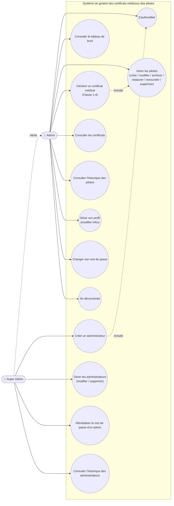
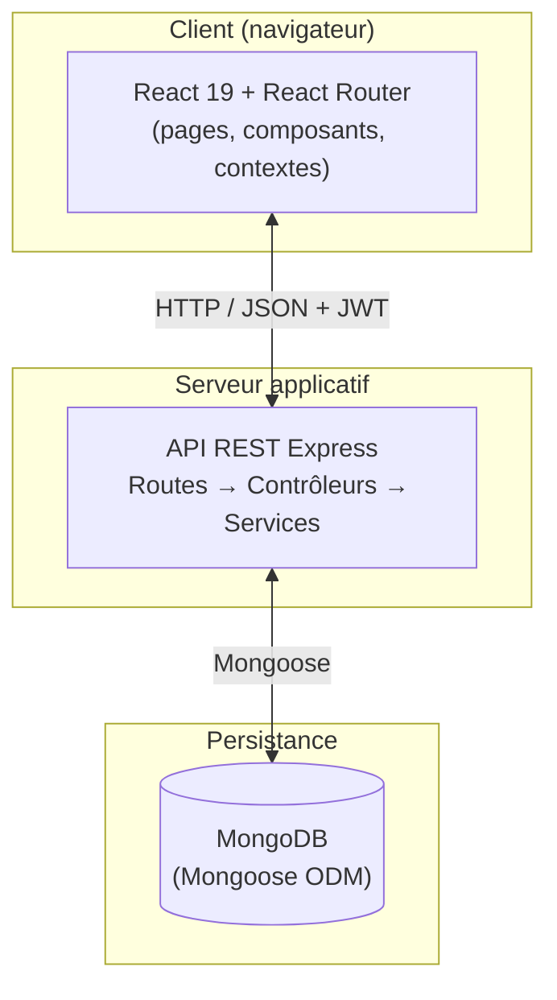
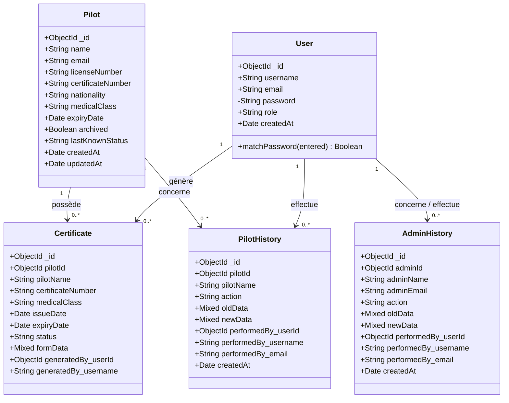
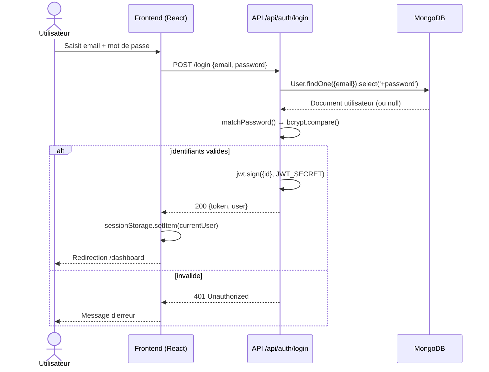
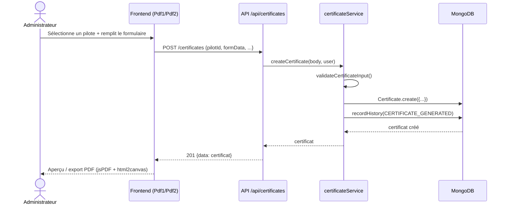

# Rapport de Projet de Fin d'Études (PFE)

## Plateforme de gestion des certificats médicaux des pilotes

---

**Établissement d'accueil :** [à compléter : nom de l'entreprise/organisme]
**Période de stage :** [à compléter : dates de début et fin]
**Encadrant professionnel :** [à compléter]
**Encadrant académique :** [à compléter]
**Réalisé par :** [à compléter : nom de l'étudiant(e)]
**Filière / Année universitaire :** [à compléter]

---

## Remerciements

[à compléter]

---

## Table des matières

1. Introduction générale
2. Chapitre 1 — Contexte général du projet
3. Chapitre 2 — Étude de l'existant et spécification des besoins
4. Chapitre 3 — Conception
5. Chapitre 4 — Environnement technique et réalisation
6. Chapitre 5 — Sécurité et tests
7. Conclusion générale et perspectives
8. Annexes

---

## Introduction générale

Les pilotes d'avion sont soumis, selon leur classe de licence (ATPL, CPL, PPL, ATCO...), à une obligation réglementaire de renouvellement périodique de leur **certificat médical d'aptitude** (classes 1 à 4, délivré par un examinateur médical agréé — AME/AMC). Le suivi manuel de ces échéances (tableurs, dossiers papier) est source de risques : oubli de renouvellement, perte de traçabilité des décisions administratives, absence d'historique en cas d'audit ou de litige.

Ce projet consiste à concevoir et développer une **plateforme web centralisée** permettant à des administrateurs de gérer le cycle de vie complet des certificats médicaux des pilotes : création des dossiers pilotes, génération des certificats selon les modèles officiels, suivi automatique des statuts (actif / expirant / expiré), traçabilité complète de chaque action, et gestion des comptes administrateurs avec des niveaux d'habilitation différenciés.

[à compléter : reformuler selon le contexte réel du stage — commanditaire, motivation métier précise, périmètre validé avec l'encadrant]

---

## Chapitre 1 — Contexte général du projet

### 1.1 Présentation de l'organisme d'accueil

[à compléter : activité de l'entreprise, organigramme, service d'accueil]

### 1.2 Problématique

La gestion des échéances de certificats médicaux de pilotes présente plusieurs difficultés lorsqu'elle repose sur des outils non spécialisés (Excel, papier) :

- **Absence d'alerte automatique** avant l'expiration d'un certificat, avec un risque qu'un pilote vole avec un certificat périmé.
- **Aucune traçabilité** : impossible de savoir qui a modifié, renouvelé ou archivé un dossier pilote, ni quand.
- **Gestion des droits inexistante** : tout utilisateur ayant accès au fichier peut tout modifier, sans distinction de rôle.
- **Génération de documents manuelle** : les certificats (formulaires réglementaires) sont recopiés à la main, source d'erreurs de saisie et de perte de temps.
- **Absence de vision globale** : pas d'indicateur consolidé (nombre de certificats actifs, expirants, expirés) pour piloter l'activité.

### 1.3 Objectifs du projet

- Centraliser la gestion des dossiers pilotes et de leurs certificats médicaux dans une application web unique.
- Automatiser le calcul du statut d'un certificat (actif / expirant sous 30 jours / expiré) et alerter l'utilisateur via une notification.
- Générer les certificats médicaux selon deux modèles réglementaires distincts (formulaires "Pdf1" et "Pdf2").
- Assurer une **traçabilité complète** (audit trail) de toutes les actions effectuées sur les pilotes et sur les comptes administrateurs.
- Mettre en place une gestion des rôles à deux niveaux (administrateur / super-administrateur) avec des permissions différenciées.
- Fournir un tableau de bord synthétique de l'activité.

### 1.4 Méthodologie de travail

[à compléter : méthode de gestion de projet suivie — agile/Scrum, sprints, outils de suivi (Trello, Jira...), planning prévisionnel]

---

## Chapitre 2 — Étude de l'existant et spécification des besoins

### 2.1 Étude de l'existant

[à compléter : описание du système utilisé avant le projet (Excel, papier, autre logiciel), ses limites concrètes observées chez le client]

### 2.2 Solution proposée

Une application web full-stack avec une séparation claire entre un client React (interface utilisateur) et une API REST Node.js/Express (logique métier et accès aux données), adossée à une base de données NoSQL MongoDB.

### 2.3 Identification des acteurs

| Acteur | Description |
|---|---|
| **Administrateur** | Utilisateur métier standard : gère les pilotes, génère les certificats, consulte l'historique et le tableau de bord, gère son propre profil. |
| **Super-administrateur** | Hérite de tous les droits de l'administrateur, et gère en plus les comptes administrateurs (création, modification, suppression, réinitialisation de mot de passe) ainsi que l'historique des actions d'administration. |

### 2.4 Spécification des besoins fonctionnels

- **Authentification** : connexion par email/mot de passe, session sécurisée par jeton JWT.
- **Gestion des pilotes** : création, consultation, modification, archivage, restauration, renouvellement (mise à jour de la date d'expiration), suppression définitive ; recherche multicritère (nom, licence, nationalité, classe médicale) ; filtrage par statut ; pagination et tri.
- **Gestion des certificats** : génération d'un certificat médical à partir d'un des deux formulaires officiels, association au pilote concerné, consultation par certificat ou par pilote, export/rendu PDF.
- **Suivi automatique des statuts** : recalcul du statut de chaque pilote non archivé (`actif` / `expirant` / `expiré`) à chaque consultation, avec journalisation automatique du passage à l'état "expiré".
- **Historique (audit trail)** : journalisation de chaque action métier sur un pilote (création, modification, archivage, restauration, renouvellement, suppression, expiration, génération de certificat) avec l'état avant/après et l'auteur.
- **Gestion des administrateurs** (super-admin) : création, modification, suppression de comptes admin, réinitialisation de mot de passe, avec historique dédié.
- **Tableau de bord** : indicateurs consolidés (total pilotes, certificats actifs/expirants/expirés, certificats générés dans le mois, activité récente).
- **Gestion du profil** : modification des informations personnelles, changement de mot de passe.
- **Notifications** : alerte visuelle (cloche) sur les pilotes dont le certificat est expiré ou expire bientôt.

### 2.5 Besoins non fonctionnels

- **Sécurité** : mots de passe hashés (bcrypt), authentification par jeton signé (JWT), contrôle d'accès par rôle sur chaque route sensible.
- **Ergonomie** : interface responsive, thème clair/sombre.
- **Performance** : pagination des listes, index MongoDB sur les champs les plus consultés (recherche textuelle, tri par date).
- **Maintenabilité** : architecture en couches (route → contrôleur → service → modèle), séparation claire des responsabilités.
- **Traçabilité** : aucune action de mutation de données (pilote ou admin) ne doit pouvoir être effectuée sans être historisée.

### 2.6 Diagramme de cas d'utilisation



---

## Chapitre 3 — Conception

### 3.1 Architecture générale

L'application suit une architecture **client-serveur en trois niveaux** :



Le backend applique systématiquement le motif **Route → Contrôleur → Service → Modèle** :
- la **route** déclare l'URL et les middlewares de sécurité (`protect`, `isSuperAdmin`) ;
- le **contrôleur** gère la requête/réponse HTTP et délègue au service ;
- le **service** porte toute la logique métier (validation, calcul de statut, historisation) et dialogue avec le modèle Mongoose ;
- le **modèle** définit le schéma de données et les contraintes de validation au niveau base.

### 3.2 Modèle de données — Diagramme de classes



**Dictionnaire de données (extraits clés) :**

| Entité | Champ | Type | Règle de gestion |
|---|---|---|---|
| Pilot | `medicalClass` | enum | `1`, `2`, `3` ou `4` uniquement |
| Pilot | `lastKnownStatus` | enum | `active` / `expiring` / `expired` / `unknown`, recalculé automatiquement |
| Certificate | `formData` | JSON libre | contenu du formulaire (Pdf1 ou Pdf2) au moment de la génération |
| User | `role` | enum | `admin` / `superadmin` |
| PilotHistory | `action` | enum | `PILOT_CREATED`, `PILOT_UPDATED`, `PILOT_ARCHIVED`, `PILOT_RESTORED`, `PILOT_RENEWED`, `PILOT_EXPIRED`, `PILOT_DELETED`, `CERTIFICATE_GENERATED` |
| AdminHistory | `action` | enum | `ADMIN_CREATED`, `ADMIN_UPDATED`, `ADMIN_PASSWORD_RESET`, `ADMIN_DELETED` |

### 3.3 Règle métier — calcul du statut d'un pilote

Le statut n'est jamais saisi manuellement : il est dérivé de la date d'expiration à chaque consultation (`computeStatus`) :

- `expiré` si la date d'expiration est dépassée ;
- `expirant` si elle est à 30 jours ou moins ;
- `actif` sinon.

Une fonction de synchronisation (`syncPilotStatuses`) parcourt tous les pilotes non archivés avant chaque listing et avant le calcul des statistiques du tableau de bord ; si un pilote bascule vers `expiré`, l'événement est automatiquement historisé, sans intervention humaine.

### 3.4 Diagramme de séquence — Authentification



### 3.5 Diagramme de séquence — Génération d'un certificat



---

## Chapitre 4 — Environnement technique et réalisation

### 4.1 Choix technologiques

| Couche | Technologie | Rôle |
|---|---|---|
| Frontend | React 19 + Vite | Interface utilisateur (SPA) |
| Frontend | React Router 7 | Navigation et protection des routes par rôle |
| Frontend | Axios | Appels HTTP vers l'API |
| Frontend | jsPDF + html2canvas | Génération/export des certificats en PDF |
| Frontend | Recharts | Graphiques du tableau de bord |
| Frontend | Framer Motion | Animations d'interface |
| Frontend | lucide-react | Icônes |
| Backend | Node.js + Express 4 | Serveur API REST |
| Backend | Mongoose 7 | ODM MongoDB (schémas, validation) |
| Backend | bcryptjs | Hashage des mots de passe |
| Backend | jsonwebtoken | Génération/vérification des jetons JWT |
| Backend | cors, dotenv | Configuration et sécurité de base |
| Base de données | MongoDB | Stockage NoSQL orienté documents |

### 4.2 Structure du projet

```
backend/
  server.js                → point d'entrée, montage des routes /api/*
  authController.js / authRoutes.js / authMiddleware.js
  models/                  → Pilot, Certificate, PilotHistory, AdminHistory (+ User.js)
  controllers/             → gèrent req/res, délèguent aux services
  services/                → logique métier (statuts, historisation, validation)
  routes/                  → déclarent les endpoints et middlewares de protection
  utils/validation.js      → règles de validation des entrées

src/
  pages/                   → Dashboard, Pilots, Certificates, History, Profile,
                              AdminManagement, AdminHistory, Login, Register
  components/               → Sidebar, NavbarUser, NotificationBell, Pdf1, Pdf2, Footer
  context/                  → ToastContext, ThemeContext
  utils/                    → wrappers d'appel API (pilots.js, certificates.js, pilotHistory.js)
```

### 4.3 API REST — synthèse des endpoints

| Ressource | Méthode | Endpoint | Accès |
|---|---|---|---|
| Auth | POST | `/api/auth/login` | Public |
| Auth | POST | `/api/auth/register` | Super-admin |
| Auth | GET | `/api/auth/me` | Authentifié |
| Auth | PUT | `/api/auth/me` | Authentifié |
| Auth | PUT | `/api/auth/change-password` | Authentifié |
| Auth | GET/PUT/DELETE | `/api/auth/admins[/:id]` | Super-admin |
| Auth | PUT | `/api/auth/admins/:id/reset-password` | Super-admin |
| Pilotes | GET/POST | `/api/pilots` | Authentifié |
| Pilotes | GET/PUT/DELETE | `/api/pilots/:id` | Authentifié |
| Pilotes | PATCH | `/api/pilots/:id/renew` \| `/archive` \| `/restore` | Authentifié |
| Certificats | GET/POST | `/api/certificates` | Authentifié |
| Certificats | GET | `/api/certificates/:id` \| `/pilot/:pilotId` | Authentifié |
| Historique pilotes | GET | `/api/pilot-history[/:id]` | Authentifié |
| Historique admins | GET | `/api/admin-history` | Super-admin |
| Dashboard | GET | `/api/dashboard/stats` | Authentifié |

### 4.4 Description des principaux écrans

[à compléter : captures d'écran de Login, Dashboard, Pilots, Certificates, Pdf1/Pdf2, History, AdminManagement, Profile]

- **Login** : authentification, redirection selon rôle.
- **Dashboard** : indicateurs clés + activité récente.
- **Pilots** : liste filtrable/triable, actions (créer, éditer, archiver, restaurer, renouveler, supprimer).
- **Certificates** : liste des certificats générés, lien vers le pilote associé.
- **Pdf1 / Pdf2** : formulaires de génération de certificat selon le modèle réglementaire choisi, export PDF.
- **History** : journal chronologique des actions sur les pilotes.
- **AdminManagement / AdminHistory** : gestion des comptes admin (super-admin uniquement) et leur historique.
- **Profile** : édition des informations personnelles et du mot de passe.

---

## Chapitre 5 — Sécurité et tests

### 5.1 Mesures de sécurité mises en œuvre

- **Hashage des mots de passe** avec `bcryptjs` (salt de 10 tours) avant chaque sauvegarde ; le champ `password` n'est jamais retourné par défaut (`select: false`).
- **Authentification par JWT** signé côté serveur (`process.env.JWT_SECRET`), vérifié à chaque requête protégée par le middleware `protect`.
- **Contrôle d'accès par rôle** via le middleware `isSuperAdmin`, appliqué sur toutes les routes de gestion des comptes admin et de leur historique.
- **Validation des entrées** côté serveur (`utils/validation.js`) indépendamment de la validation côté client, pour ne jamais faire confiance uniquement au frontend.
- **Traçabilité systématique** : toute mutation de données sensibles (pilote, admin) génère une entrée d'historique non modifiable a posteriori par l'interface.

### 5.2 Stratégie de test

[à compléter selon ce qui a réellement été fait : tests manuels par écran, jeux d'essai, éventuels tests unitaires/intégration, outils utilisés]

Points de vigilance testés en priorité :
- Connexion avec identifiants invalides / expirés.
- Accès à une route super-admin avec un compte admin simple (doit être refusé — 403).
- Cohérence du recalcul de statut pilote autour du seuil des 30 jours.
- Cohérence de l'historique après chaque action (création, modification, archivage, suppression).

### 5.3 Difficultés rencontrées

[à compléter]

---

## Conclusion générale et perspectives

Ce projet a permis de concevoir et de développer une plateforme complète de gestion des certificats médicaux des pilotes, couvrant l'ensemble du cycle de vie d'un dossier pilote (création, suivi, renouvellement, archivage) ainsi que la génération de certificats conformes aux modèles réglementaires, avec une traçabilité intégrale des actions et une gestion des rôles à deux niveaux.

**Perspectives d'amélioration :**
- Envoi de notifications par email/SMS à l'approche d'une échéance, en complément de l'alerte visuelle actuelle.
- Export global des statistiques du tableau de bord (PDF/Excel).
- Authentification à deux facteurs pour les comptes super-admin.
- Journalisation des tentatives de connexion échouées.
- [à compléter selon les retours du jury/encadrant]

---

## Annexes

- Annexe A : Diagramme de classes complet (voir §3.2)
- Annexe B : Diagramme de cas d'utilisation complet (voir §2.6)
- Annexe C : [à compléter : captures d'écran, extraits de code significatifs]

---

## Bibliographie / Webographie

[à compléter : documentation officielle React, Express, MongoDB/Mongoose, JWT, etc.]
